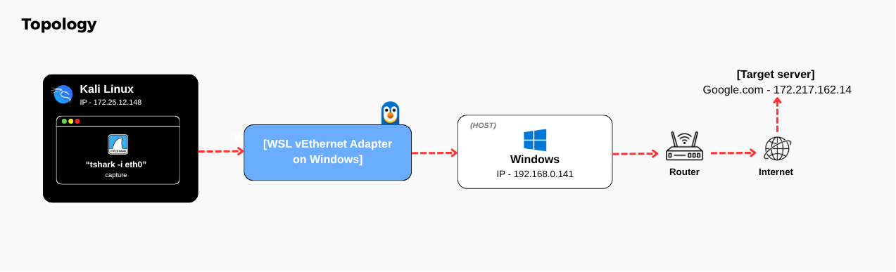

# 🦈 Forense de Rede com Wireshark

Home lab de cibersegurança focado em forense de rede, análise de tráfego e investigação de incidentes usando **Wireshark** e **tshark** sobre protocolos reais de rede (DNS, TCP, TLS) e simulação de resposta a incidentes de malware.

O projeto simula o fluxo de trabalho de um analista de **SOC / Blue Team**: captura de tráfego, dissecação protocolo por protocolo, extração de IOCs e produção de relatórios técnicos de investigação.

---

## 📌 Visão Geral do Projeto

Este repositório contém todo o ambiente, capturas PCAP, evidências em capturas de tela e relatórios analíticos gerados durante as 6 fases do laboratório:

1. **[Fase 01 — Captura de Tráfego Real](laboratorio-resposta-incidentes-wireshark/README.md#-fase-01--captura-de-tráfego-real):** Validação do ambiente Kali/WSL2, geração de tráfego real e captura inicial (`lab_capture.pcapng`).
2. **[Fase 02 — Análise de DNS](laboratorio-resposta-incidentes-wireshark/relatorios/analise_dns.md):** Dissecação de consultas/respostas DNS, comportamento dual-stack (A/AAAA), latência de resolução e diagnóstico de falhas (NXDOMAIN e sufixos de busca DNS).
3. **[Fase 03 — Análise de TCP](laboratorio-resposta-incidentes-wireshark/relatorios/analise_tcp.md):** Análise de handshakes de 3 vias, controle de fluxo (Window Scaling, MSS), análise de streams TCP e diagnóstico de retransmissões/Dup ACKs.
4. **[Fase 04 — Análise de TLS](laboratorio-resposta-incidentes-wireshark/relatorios/analise_tls.md):** Inspeção de handshakes TLS 1.3 (Client/Server Hello), análise de cipher suites e identificação de troca de chaves híbrida pós-quântica (**X25519MLKEM768**).
5. **[Fase 05 — Investigação de Incidente](laboratorio-resposta-incidentes-wireshark/relatorios/relatorio_incidente.md):** Investigação do cenário real *"First to Last"* (malware FormBook), identificando o host e usuário comprometidos (`DESKTOP-5NLV63K` / `Raymond Vance`) via Kerberos/SAMR e extraindo 15 domínios de C2 e IOCs.
6. **[Fase 06 — Síntese e Lições Aprendidas](laboratorio-resposta-incidentes-wireshark/licoes_aprendidas.md):** Mapeamento no framework **MITRE ATT&CK** e recomendações defensivas para equipes de SOC.

---

## 💻 Ambiente Técnico & Topologia

- **Sistema Operacional:** Kali Linux rodando em WSL2 (Windows Host)
- **Ferramentas:** Wireshark, tshark, tcpdump, dig, curl, netcat, unzip
- **Topologia de Rede:** `Kali (WSL2) → Adaptador vEthernet → Windows (Host) → Roteador → Internet → Servidor Destino`



---

## 📂 Estrutura do Repositório

```text
Network-Forensics-with-Wireshark/
├── README.md                                       # Documentação principal
└── laboratorio-resposta-incidentes-wireshark/
    ├── README.md                                   # Guia completo do laboratório por fases
    ├── comandos_e_conceitos.md                     # Guia técnico de comandos executados e fundamentos teóricos
    ├── licoes_aprendidas.md                        # Síntese técnica, lições aprendidas e MITRE ATT&CK
    ├── arquitetura/
    │   └── topologia.png                           # Diagrama de topologia da rede
    ├── pcaps/
    │   ├── lab_capture.pcapng                      # Captura real gerada no Kali/WSL2 (Fases 1-4)
    │   └── incidente/
    │       ├── 2026-08-09-traffic-analysis-exercise.pcap # PCAP de infecção do FormBook
    │       └── README.md                           # Instruções e detalhes do cenário de incidente
    ├── relatorios/                                 # Relatórios técnicos detalhados
    │   ├── analise_dns.md                          # Relatório de análise do protocolo DNS
    │   ├── analise_tcp.md                          # Relatório de análise do protocolo TCP
    │   ├── analise_tls.md                          # Relatório de análise do protocolo TLS
    │   ├── relatorio_incidente.md                  # Relatório técnico de investigação do incidente
    │   └── relatorio_final.md                      # Relatório executivo consolidado do projeto
    └── capturas_de_tela/                           # Capturas de tela organizadas por fase
        ├── fase1_captura_geral/
        ├── fase2_dns/
        ├── fase3_tcp/
        ├── fase4_tls/
        └── fase5_incidente/
```

---

## 📑 Relatórios & Guias Técnicos

- **[Guia Técnico de Comandos & Conceitos Teóricos](laboratorio-resposta-incidentes-wireshark/comandos_e_conceitos.md)**
- **[Relatório de Análise DNS](laboratorio-resposta-incidentes-wireshark/relatorios/analise_dns.md)**
- **[Relatório de Análise TCP](laboratorio-resposta-incidentes-wireshark/relatorios/analise_tcp.md)**
- **[Relatório de Análise TLS](laboratorio-resposta-incidentes-wireshark/relatorios/analise_tls.md)**
- **[Relatório de Investigação de Incidente (FormBook)](laboratorio-resposta-incidentes-wireshark/relatorios/relatorio_incidente.md)**
- **[Relatório Executivo Final](laboratorio-resposta-incidentes-wireshark/relatorios/relatorio_final.md)**
- **[Lições Aprendidas & MITRE ATT&CK](laboratorio-resposta-incidentes-wireshark/licoes_aprendidas.md)**

---

## 🎯 Autor & Propósito

Desenvolvido por **Giovanne Santos** como projeto prático de portfólio para demonstrar habilidades em **Network Forensics** (Forense de Rede), **Traffic Analysis** (Análise de Tráfego) e **Incident Response** (Resposta a Incidentes) voltadas para atuação em equipes de **SOC / Blue Team**.
