# 🦈 Wireshark Incident Response Lab

Home lab de cibersegurança focado em forense de rede, análise de tráfego e investigação de incidentes usando Wireshark/tshark sobre protocolos de rede reais (DNS, TCP, TLS) e cenários reais de infecção por malware.

---

## 📋 Descrição do Laboratório

Este projeto simula o fluxo de trabalho de um analista de SOC/Blue Team: captura de tráfego, dissecação protocolo por protocolo, extração de indicadores de comprometimento (IOCs) e produção de relatórios técnicos fundamentados como se fossem evidências de uma investigação real.

### 🛠️ Ambiente Técnico

- **Sistema:** Kali Linux rodando em WSL2 (Windows)
- **Ferramentas:** Wireshark, tshark, tcpdump, dig, curl, netcat, unzip
- **Topologia:** `Kali (WSL2) → Adaptador vEthernet → Windows (Host) → Roteador → Internet → Servidor Destino`


### 🗺️ Painel de Progresso

| Fase | Descrição | Status |
| :--- | :--- | :---: |
| **01** | Captura de tráfego real (`lab_capture.pcapng`) | ✅ Concluída |
| **02** | Análise de DNS (queries, respostas, A vs AAAA, NXDOMAIN) | ✅ Concluída |
| **03** | Análise de TCP (handshake, window scaling, retransmissões) | ✅ Concluída |
| **04** | Análise de TLS (handshake TLS 1.3, cifra pós-quântica) | ✅ Concluída |
| **05** | Investigação de Incidente (FormBook C2, IOCs, Kerberos/SAMR) | ✅ Concluída |
| **06** | Síntese, MITRE ATT&CK e Lições Aprendidas | ✅ Concluída |

---

## 🟢 Fase 01 — Captura de Tráfego Real

> 🎯 **Objetivo:** Validar o funcionamento do ambiente Kali/WSL2 e gerar a primeira captura (`lab_capture.pcapng`) para embasar as análises dos protocolos DNS, TCP e TLS.

### Passo 1 — Inicie a Captura

No diretório `pcaps`, execute o `tshark` ouvindo em todas as interfaces:

```bash
cd ~/Network-Forensics-with-Wireshark/wireshark-incident-response-lab/pcaps
tshark -i any -w lab_capture.pcapng
```

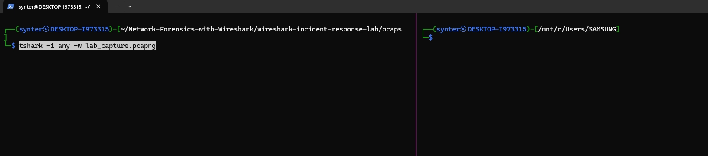

> 🔧 **Achado Técnico — Por que `-i any` em vez de `-i eth0`?**
> Uma tentativa inicial capturando apenas na `eth0` não registrava o tráfego DNS, mesmo com o `dig` funcionando. Ao investigar com `tcpdump` e `ip route`, confirmou-se que embora a `eth0` seja a rota padrão, as consultas DNS para o gateway local (`10.255.255.254`) trafegam por uma interface interna separada do WSL2. A captura com `-i any` resolveu o problema, documentando uma particularidade real do ambiente WSL2.

### Passo 2 — Gere Tráfego Variado

Em um segundo terminal, execute:

```bash
dig google.com
dig +tcp cloudflare.com
nc -v example.com 80
curl -v https://example.com
```

### Passo 3 — Finalize e Valide a Captura

Interrompa a captura com `Ctrl+C` e valide o total de pacotes capturados:

```bash
tshark -r lab_capture.pcapng | wc -l
```

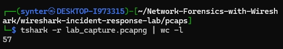

### Passo 4 — Inspeção Inicial no Wireshark GUI

```bash
wireshark lab_capture.pcapng
```

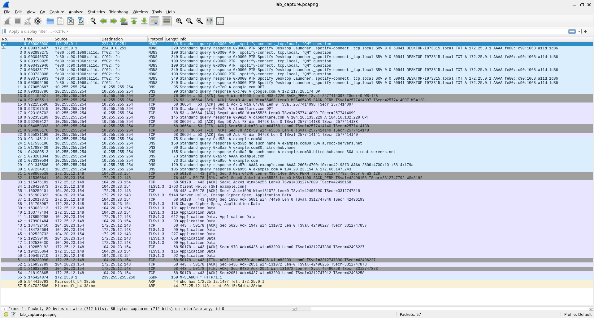

### Resumo dos Protocolos Capturados

- **DNS (Pacotes 11-30):** Queries A/AAAA para `google.com`, `cloudflare.com` e `example.com`.
  
  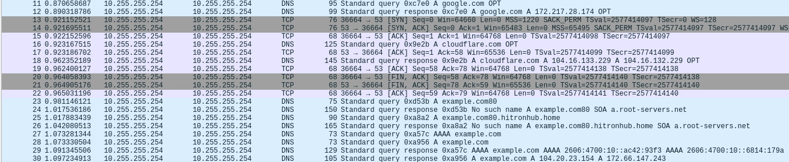

- **TCP Handshake (Pacotes 13-15, 31-33):** Handshakes de 3 vias (SYN, SYN-ACK, ACK) nas portas 53 e 443.
  
  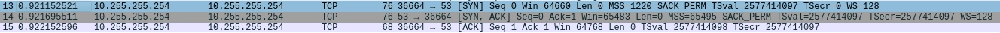

- **TLS 1.3 (Pacotes 34-54):** Handshake criptografado para `example.com`.
  
  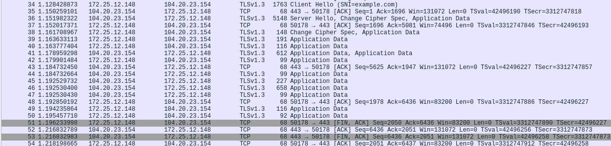

---

## 🔵 Fase 02 — Análise de DNS

> 🎯 **Objetivo:** Analisar o comportamento do protocolo DNS, tempos de resposta e resolução de nomes.

### Passo 1 — Isolamento do Tráfego DNS

```bash
tshark -r lab_capture.pcapng -Y "dns"
```

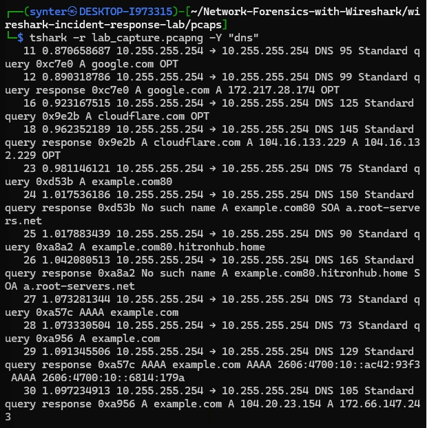

### Passo 2 — Extração Tabular de Campos

```bash
tshark -r lab_capture.pcapng -Y "dns" -T fields -e frame.number -e frame.time_relative -e ip.src -e ip.dst -e dns.flags.response -e dns.qry.name -e dns.qry.type -e dns.a -e dns.aaaa -e dns.flags.rcode
```

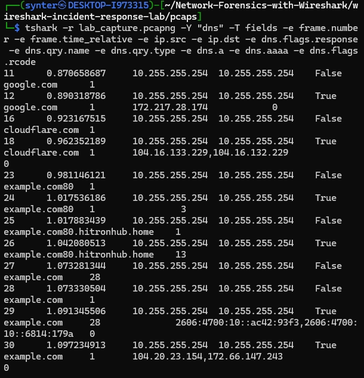

### Passo 3 — Análise de Falhas (NXDOMAIN e Search Suffix)

```bash
tshark -r lab_capture.pcapng -Y "dns.flags.rcode == 3"
```

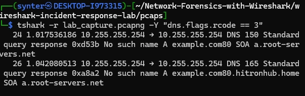

> ⚠️ **Diagnóstico da Falha NXDOMAIN:**
>
> 1. Pacote 24: O comando `dig example.com80` gerou uma requisição para `example.com80` (erro de digitação), resultando em `NXDOMAIN` (rcode 3).
> 2. Pacote 26: O sistema operacional tentou acrescentar o sufixo de busca local (`example.com80.hitronhub.home`), que também não existia, gerando novo `NXDOMAIN`.

### Registros A vs AAAA (Dual-Stack)

- **Registro A:** Mapeia domínio para IPv4 (`example.com -> 104.20.23.154`).
- **Registro AAAA:** Mapeia domínio para IPv6 (`example.com -> 2606:4700:10::ac42:93f3`).
- **Mecanismo Happy Eyeballs:** O cliente envia requisições A e AAAA simultaneamente, optando por se conectar via IPv4 (`104.20.23.154`).

---

## 🟣 Fase 03 — Análise de TCP

> 🎯 **Objetivo:** Analisar o ciclo de vida das conexões TCP, controle de fluxo e detecção de retransmissões.

### Passo 1 — Pacotes de Controle (SYN e FIN)

```bash
tshark -r lab_capture.pcapng -Y "tcp.flags.syn==1 || tcp.flags.fin==1"
```

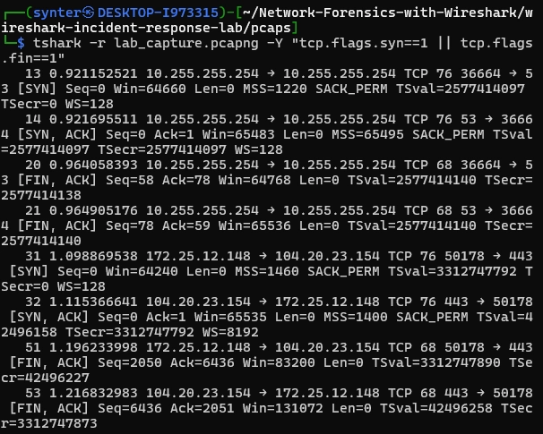

### Passo 2 — Identificação dos Streams TCP

```bash
tshark -r lab_capture.pcapng -T fields -e tcp.stream -Y tcp | sort -u
```

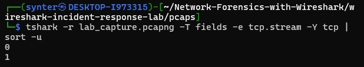

| Stream | Descrição do Tráfego | Porta Destino |
| :---: | :--- | :---: |
| **0** | DNS sobre TCP (`10.255.255.254`) | 53 |
| **1** | TLS/HTTPS (`example.com` - `104.20.23.154`) | 443 |

### Passo 3 — Análise do Stream 0 (DNS/TCP)

- **Handshake (3-way):** Pacotes 13-15 (`SYN` -> `SYN-ACK` -> `ACK`).
- **Troca de Dados:** Pacotes 16-19 (Query `cloudflare.com` e resposta A/AAAA).
- **Encerramento Gracioso:** Pacotes 20-22 (`FIN-ACK` -> `FIN-ACK` -> `ACK`).
- **Parâmetros Negociados:** `MSS=1220`, `Window Scaling=128`, `SACK_PERM`.

### Passo 4 — Análise do Stream 1 (HTTPS/TLS) e Diagnóstico de Retransmissão

Ao analisar anomalias de TCP:

```bash
tshark -r lab_capture.pcapng -Y "tcp.analysis.retransmission || tcp.analysis.duplicate_ack || tcp.analysis.zero_window"
```

Foi identificado um único **Duplicate ACK** no pacote 35 (`[TCP Dup ACK 34#1]`). Isso é decorrente de jitter na interface virtualizada do WSL2 e não disparou retransmissão rápida (que exige 3 ACKs duplicados consecutivos).

---

## 🟠 Fase 04 — Análise de TLS

> 🎯 **Objetivo:** Inspecionar a negociação TLS 1.3 e extrair parâmetros de segurança.

### Passo 1 — Isolamento das Mensagens de Handshake

```bash
tshark -r lab_capture.pcapng -Y "tls.record.content_type==22"
```

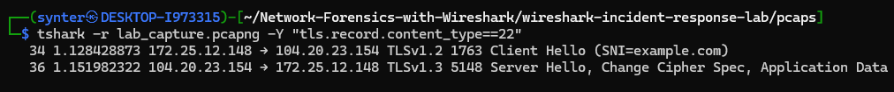

### Passo 2 — Inspeção do Client Hello (Pacote 34)

- **Versão no Registro:** `TLS 1.0 (0x0301)` (envelope externo mantido por compatibilidade histórica).
- **Extensão `supported_versions`:** Anuncia suporte a `TLS 1.3`.
- **Encapsulamento SLL:** Por utilizar `-i any`, o frame utiliza *Linux cooked capture v1 (SLL)*.
- **Cipher Suites Oferecidas:** 90 suítes no total, com prioridade para as cifras nativas de TLS 1.3 (`TLS_AES_256_GCM_SHA384`, `TLS_CHACHA20_POLY1305_SHA256`, `TLS_AES_128_GCM_SHA256`).

### Passo 3 — Inspeção do Server Hello (Pacote 36)

```bash
tshark -r lab_capture.pcapng -Y "frame.number==36" -V | grep -A 30 "Transport Layer Security"
```

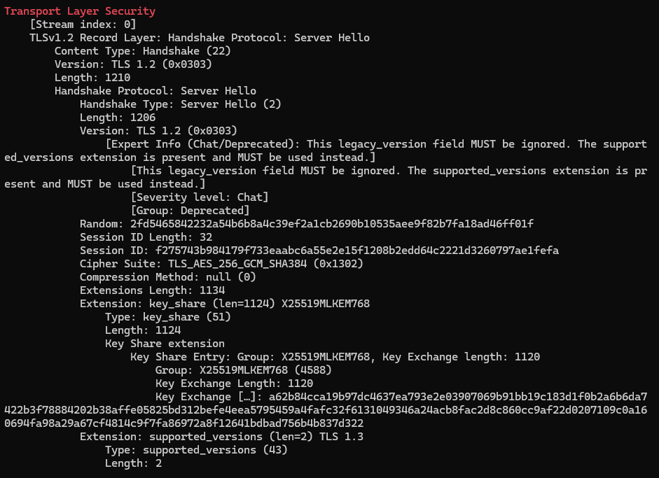

- **Suíte Selecionada:** `TLS_AES_256_GCM_SHA384 (0x1302)`.
- **Compressão:** `null (0)` (evita vulnerabilidades como CRIME e BREACH).
- **🔒 Troca de Chaves Pós-Quântica (X25519MLKEM768):**
  A extensão `key_share` utiliza o grupo **X25519MLKEM768**, combinando a curva elíptica **X25519** com o algoritmo pós-quântico **ML-KEM-768** (Kyber-768) padronizado pelo NIST. O payload de 1120 bytes protege a comunicação contra ataques do tipo *"Harvest Now, Decrypt Later"*.

---

## 🔴 Fase 05 — Investigação de Incidente (FormBook Malware)

> 🎯 **Cenário:** Investigação de um alerta do SOC referente a infecção pelo infostealer **FormBook** (*Scenario "First to Last"* de `malware-traffic-analysis.net`).

### 📌 Mapeamento da Infraestrutura e Host Afetado

| Questão do Exercício | Dado Identificado | Protocolo / Técnica Utilizada |
| :--- | :--- | :--- |
| **IP do Host Infectado** | `172.16.8.49` | Análise de requisições HTTP em massa |
| **Endereço MAC** | `00:12:f0:28:d4:34` | Extração de campo `eth.src` no tshark |
| **Hostname** | `DESKTOP-5NLV63K` | Kerberos `CNameString` (`DESKTOP-5NLV63K$`) e NBNS |
| **Nome de Usuário** | `rvance` | Requisições Kerberos TGT (`rvance@FIRSTTOLAST.TECH`) |
| **Nome Completo** | `Raymond Vance` | Consulta **SAMR QueryUserInfo** (Pacote 2947) |

### 🚩 Análise de Tráfego Malicioso & IOCs

- **User-Agent Falso (Hardcoded):** `Mozilla/5.0 (Windows NT 6.2; rv:39.0) Gecko/20100101 Firefox/39.0` (Incompatível com o SO real do host e desatualizado).
- **Padrão de Beaconing:** Ciclo regular a cada ~8 minutos percorrendo **15 domínios de C2** distintos em sequência.
- **Exfiltração de Dados:** Parâmetros de query string `?2kn1=<blob>` e `kbBSJ=Ep6t_fJ_`.

#### Domínios e IPs de C2 Identificados

1. `www.independent.ie` — `172.64.155.76`
2. `www.grinswakebthu.info` — `146.59.71.167`
3. `www.taibeinan.cc` — `38.182.168.246`
4. `www.legenda-sochi.com` — `45.130.41.161`
5. `www.titanium303.com` — `172.67.162.153`
6. `www.21207628.shop` — `121.54.163.148`
7. `www.kentmediallc.com` — `199.192.27.50`
8. `www.earthframe.site` — `66.29.149.91`
9. `www.p3x63q.garden` — `183.90.186.205`
10. `www.z61gqw.beer` — `156.247.51.39`
11. `www.www-bet456.co` — `172.67.219.130`
12. `www.moxom.online` — `81.2.196.19`
13. `www.thvwzs.com` — `104.21.76.210`
14. `www.devinnovationhab.team` — `104.21.42.23`
15. `www.amlgames.site` — `89.110.89.25`

### 🗺️ Mapeamento no MITRE ATT&CK

| Tática | Técnica | Evidência no Tráfego |
| :--- | :--- | :--- |
| **Command and Control** | T1071.001 – Web Protocols | Beaconing HTTP GET em texto claro |
| **Command and Control** | T1008 – Fallback Channels | Lista redundante de 15 domínios de C2 |
| **Defense Evasion** | T1036 – Masquerading | User-Agent de Firefox 39 desatualizado |
| **Exfiltration** | T1041 – Exfiltration Over C2 | Dados exfiltrados via parâmetro `2kn1=` |
| **Command and Control** | T1132 – Data Encoding | Payload codificado em formato Base64 na URL |

---

## ⚪ Fase 06 — Síntese e Lições Aprendidas

Para uma análise aprofundada sobre as lições aprendidas, particularidades de redes virtualizadas e recomendações defensivas completas para equipes de SOC, consulte o documento:

📄 **[Lições Aprendidas e Síntese Técnica](lessons_learned.md)**

---

## 📄 Relatórios & Guias do Laboratório

- 📘 **[Guia Técnico de Comandos & Conceitos Teóricos](commands_and_concepts.md)**
- 💡 **[Lições Aprendidas & Síntese Técnica](lessons_learned.md)**
- 🔗 **[Análise DNS](reports/dns_analysis.md)**
- 🔗 **[Análise TCP](reports/tcp_analysis.md)**
- 🔗 **[Análise TLS](reports/tls_analysis.md)**
- 🔗 **[Relatório do Incidente (FormBook)](reports/incident_report.md)**
- 🔗 **[Relatório Executivo Final](reports/final_report.md)**
